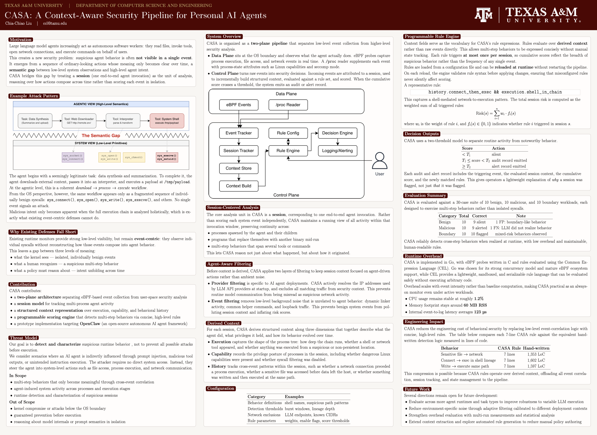
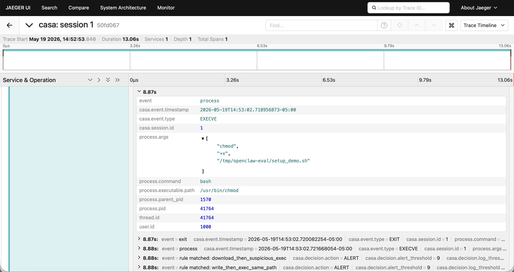

# CASA: A Context-Aware Security Pipeline for Personal AI Agents

CASA monitors AI agent runtime behavior at the OS level, using eBPF to
capture system events, grouping them into sessions, and evaluating
weighted rules over derived context to detect multi-step attack patterns
such as connect→exec and write→exec.

Built with Go, eBPF (C), and CEL. Targets OpenClaw as a representative
personal-agent runtime.

<p align="center">
  
</p>

Full poster: [Research Poster (PDF)](evaluation/poster.pdf)

## Quick Start

1. Install OpenClaw and complete onboarding. 
2. Configure a working LLM provider and API key.
3. Run setup:

```bash
./setup.sh
```

4. Build and run:

```bash
make
make run
```

To reload rules without restarting:

```bash
kill -HUP $(cat /var/run/casa.pid)
```

## Observability

CASA exports traces and logs to [Jaeger](https://www.jaegertracing.io) via OpenTelemetry. Each session produces one trace span covering its full lifetime, with structured log events attached for:

- `process`
- `file`
- `network`
- `exit`
- `rule matched: ...`
- `audit emitted`
- `alert emitted`

The root session span also records the final security state for that session, including the final risk score, final decision, and the derived execution / capability / history flags that explain why the session ended in that state.

To view traces, start a local Jaeger instance with OTLP enabled:

```bash
docker run --rm --name jaeger \
  -e COLLECTOR_OTLP_ENABLED=true \
  -p 16686:16686 \
  -p 4318:4318 \
  jaegertracing/all-in-one:latest
```

Then configure CASA to export traces to Jaeger:

```env
CASA_OTEL_EXPORTER_OTLP_ENDPOINT=http://127.0.0.1:4318/v1/traces
CASA_OTEL_SERVICE_NAME=casa
```

You can place these values in a repo-root `.env` file or export them in your shell before starting CASA.

Then open [http://127.0.0.1:16686](http://127.0.0.1:16686), select the `casa` service, and inspect the session traces.



## Logs

| File | Contents |
|------|----------|
| `events.log` | Accepted events that entered session and context processing |
| `sessions.log` | Session snapshots, written on `periodic_flush`, `session_closed`, and `shutdown` |
| `audit.log` | Rule hits once cumulative score reaches `thresholds.log` |
| `alert.log` | Rule hits once cumulative score reaches `thresholds.alert` |

Example `alert.log` record:
```json
{
  "timestamp": "2026-05-02T17:44:19.027509477-05:00",
  "session_id": 25,
  "event": {
    "type": "EXECVE",
    "pid": 356947,
    "ppid": 338205,
    "uid": 1000,
    "comm": "bash",
    "path": "/tmp/openclaw-eval/helper.sh",
    "args": ["/tmp/openclaw-eval/helper.sh"]
  },
  "decision": {
    "action": "ALERT",
    "score": 9,
    "log_threshold": 4,
    "alert_threshold": 9,
    "triggered_rules": [
      {
        "name": "write_then_exec_same_path",
        "expr": "history.write_then_exec_same_path",
        "weight": 5
      },
      {
        "name": "write_then_exec_from_suspicious_path",
        "expr": "history.write_then_exec_same_path && execution.suspicious_path_exec",
        "weight": 4
      }
    ]
  }
}
```

## Evaluation

For evaluation, see [evaluation/README.md](evaluation/README.md).

## Requirements

See [REQUIREMENTS.md](REQUIREMENTS.md).

## Rule Configuration

Rules are defined in `rules.json` and evaluated using CEL expressions
over derived context fields. Each rule specifies:

```text
rules[].name
rules[].description
rules[].expr
rules[].weight
rules[].enabled
```

Score thresholds:

```text
thresholds.log
thresholds.alert
```

Full list of analysis configuration fields:

```text
analysis.lineage_max_depth
analysis.recent_event_limit
analysis.max_per_process_artifacts
analysis.deep_chain_threshold
analysis.burst_open_threshold
analysis.burst_connect_threshold
analysis.burst_exec_threshold
analysis.burst_window_seconds
analysis.sensitive_history_window_seconds
analysis.suspicious_path_patterns
analysis.sensitive_path_prefixes
analysis.sensitive_path_patterns
analysis.shell_names
analysis.network_tool_names
analysis.interpreter_names
analysis.container_runtime_names
analysis.dangerous_capability_names
analysis.llm_provider_urls
analysis.channel_urls
analysis.known_cidrs
analysis.configured_connect_refresh_seconds
```

## Derived Context

Context fields are available as CEL expressions in rule definitions.

### Execution

```text
execution.suspicious_path_exec
execution.deep_chain
execution.shell_in_chain
execution.network_tool_in_chain
execution.interpreter_in_chain
execution.container_runtime_in_chain
execution.memfd_or_deleted_exec
```

### Capability

```text
capability.has_dangerous_caps
capability.dangerous_count
capability.seccomp_disabled
```

### History

```text
history.connect_then_exec
history.sensitive_then_network
history.sensitive_then_execve
history.burst_open
history.burst_connect
history.burst_exec
history.write_then_exec_same_path
history.opened_deleted_path
```
