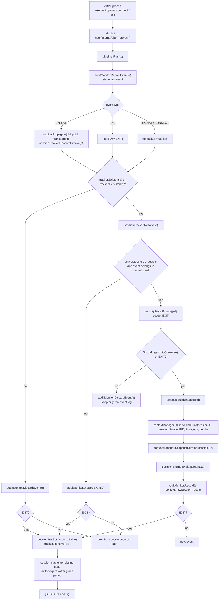

# CASA Pipeline

## Notes

- `SessionTracker` now treats a session as a CLI invocation time window, not a process-membership graph.
- `Tracker` maintains whether a pid/ppid is still inside the `openclaw-gateway` tree.
- `BuildLineage(...)` is only used for context derivation, not for session resolution.
- `EXIT` events always try to reach `sessionTracker.ObserveExit(...)` even if they are dropped by earlier gates.
- The janitor goroutine closes sessions after the configured grace period elapses.
